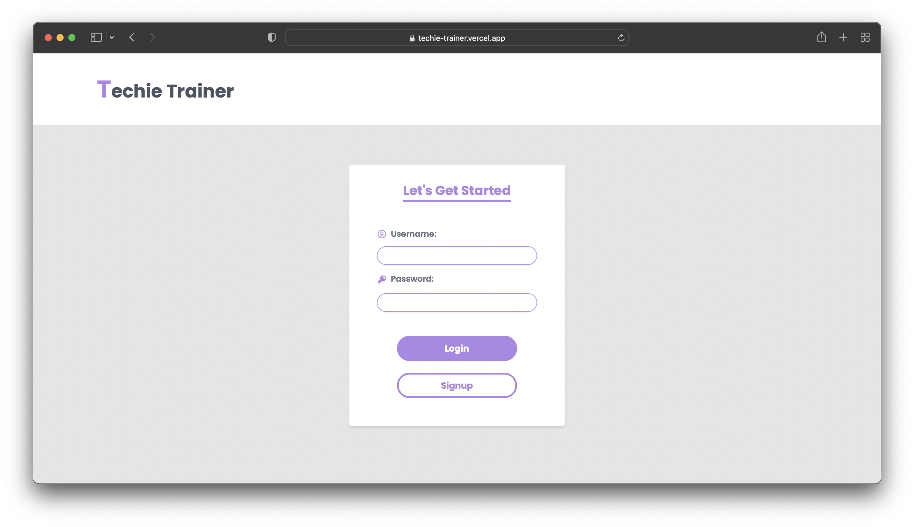
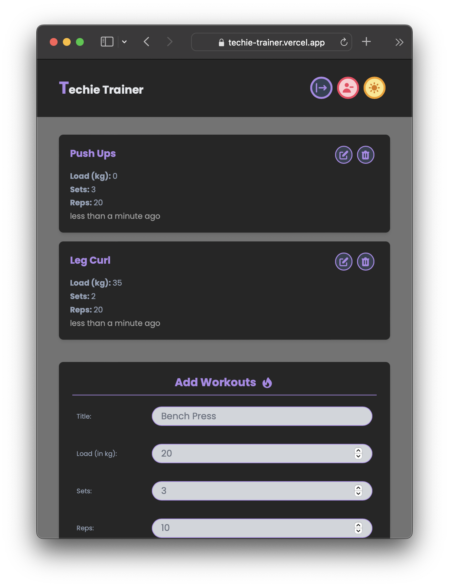

<h1 align="center">
  Techie Trainer
</h1>

  
  
  
  
  
  
  

> A MENN-stack (MongoDB, Express, NextJS, Node) app created by **McTechie** 👨‍🎨✨

---

## Concepts Covered

- Development Environment
  - [x] Docker (Docker Compose)
  - [x] Environment Variables
- Frontend
  - [x] React Hook Form
  - [x] Context API (Global State)
  - [x] Custom Hooks
  - [x] Dark Mode (Tailwind)
  - [x] Responsive Design
- Backend
  - [x] Authentication (JWT)
  - [x] Express Router
  - [x] Mongoose Schemas & Models
  - [x] MongoDB Atlas

---

## Preview

### Main Screen

### Available in Dark Mode too

---

### Simple Login Screen

### Robust Form Validation

---

### Complete CRUD Functionality

---

### You can delete your User Account too

### Completely Responsive for various Screen Sizes

